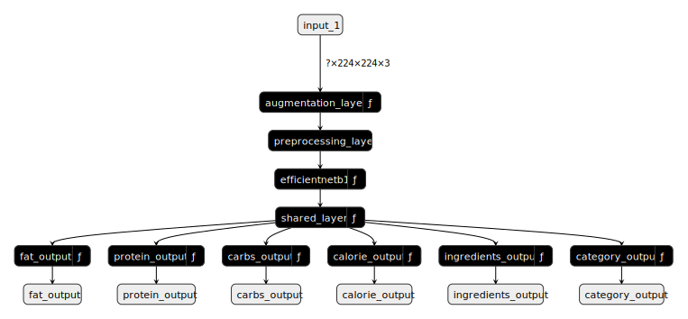

<h1 align="center">FoodNet-Model</h1>

## About

This repository hosts the model files that will be downloaded by the [FoodNet-App](https://github.com/Cheng-K/FoodNet-App). Please check out the [FoodNet](https://github.com/Cheng-K/FoodNet) and [FoodNet-App](https://github.com/Cheng-K/FoodNet-App) repositories for mroe information.

## Model Information

Diagram above shows the model structure. It takes in a **RGB image with a dimension of (224 x 224)**

It outputs :

- fat_output : Per gram of fat (1 output neuron)
- protein_output : Per gram of protein (1 output neuron)
- carbs_output : Per gram of carbs (1 output neuron)
- calorie_output : Per gram of calorie (1 output neuron)
- ingredients_output : Predicted list of ingredients based on training data (1037 output neurons)
- category_output : Predicted food category based on training data (102 output neurons)

### Performance Metrics

| Metrics                     | Value  |
| --------------------------- | ------ |
| Food category accuracy      | 0.7572 |
| Food category precision     | 0.8243 |
| Food category recall        | 0.726  |
| Food ingredients precision  | 0.8754 |
| Food ingredients recall     | 0.6257 |
| Calorie mean absolute error | 0.4167 |
| Carbs mean absolute error   | 0.0484 |
| Protein mean absolute error | 0.0167 |
| Fat mean absolute error     | 0.0429 |
